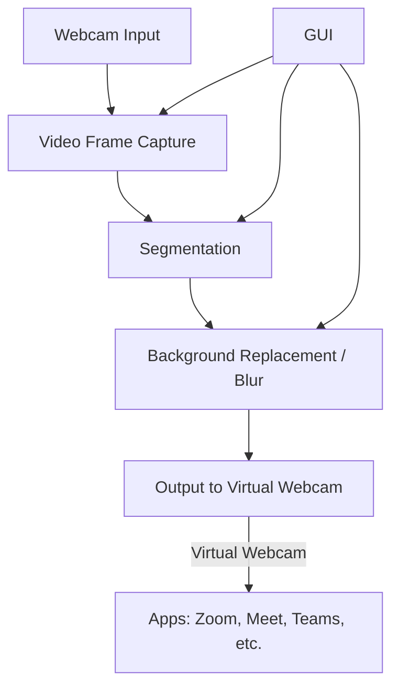

# Linux Virtual Background

A "NVIDIA Broadcast-like" virtual background application for Linux.

## 1. Architecture/System Diagram



**Legend:**

*   The GUI allows the user to select the input webcam, choose the segmentation model (PyTorch or ONNX), toggle effects, and choose a custom background image or apply a blur effect.
*   Webcam-based applications (like Zoom, Teams, Meet) can then use the newly created "virtual camera" device as if it were a physical webcam.

---

## 2. Step-by-Step Processing Flow

1.  **User launches the app (GUI).**
2.  **App detects physical webcams** available on the system.
3.  **User selects** the input webcam, segmentation model, the desired background effect (blur or a specific image), and enables the virtual camera output.
4.  **The app loads the selected segmentation model** (MODNet in PyTorch or ONNX format).
5.  **For each frame captured from the webcam:**
    a. Capture the frame.
    b. Pass the frame to the segmentation model, which outputs a mask of the person.
    c. Composite the mask over the user-selected background or apply a blur effect to the original background.
    d. Send the processed frame to the `v4l2loopback` virtual webcam device.
6.  **Any video conferencing application can now use the "virtual camera" device.**
7.  **The GUI allows for live toggling** of settings and backgrounds.

---

## 3. External Dependencies

### System Dependencies
You must have the `v4l2loopback` kernel module installed.
```bash
sudo apt install v4l2loopback-dkms
```

### Python Dependencies
*   Python 3.13+
*   See `requirements.txt` for a full list of Python packages.

You can install all the required Python packages using `pip`:
```bash
pip install -r requirements.txt
```
---

## 4. Repository Structure

```text
.
├── app/
│   ├── __init__.py
│   ├── background.py     # Background selection/blur/compositing
│   ├── camera.py         # Webcam capture logic
│   ├── gui.py            # PySide6 GUI logic
│   ├── segment.py        # Segmentation model loading/inference (PyTorch/ONNX)
│   ├── settings.py       # Config persistence (JSON)
│   └── vcam.py           # Virtual camera (v4l2loopback) handling
├── assets/
│   └── default_backgrounds/   # Sample images for backgrounds
├── models/
│   ├── modnet_webcam.onnx # Downloaded ONNX model
│   └── modnet_webcam.pth  # Downloaded PyTorch model
├── scripts/
│   ├── download_model.py      # Script to download model weights
│   └── setup_v4l2loopback.sh  # Helper script to set up virtual cam device
├── tests/
│   └── test_segment.py
├── main.py              # App entry point (launches GUI)
├── README.md
├── requirements.txt
├── virtual-background.spec # PyInstaller config
└── LICENSE
```

---

## 5. Setup and Usage

### A. Setup Virtual Webcam Device
A helper script is provided. Run it to create the virtual camera device:
```bash
sudo chmod +x scripts/setup_v4l2loopback.sh
./scripts/setup_v4l2loopback.sh
```
This will create a virtual webcam at `/dev/video10`.

### B. Running the Application

1.  **Install Dependencies:**
    Make sure you have installed the system dependencies and Python packages as described in section 3.

2.  **Download Models:**
    Run the download script to fetch the required segmentation models:
    ```bash
    python scripts/download_models.py
    ```

3.  **Launch the GUI:**
    Run the main application:
    ```bash
    python main.py
    ```
    You can now select your camera, model, and background preferences from the GUI.

---

## 6. Running Tests

To ensure all components are working correctly, you can run the suite of unit tests:
```bash
python -m unittest discover tests
```

---

## 7. Building the Application

You can create a standalone executable using PyInstaller.

1.  **Install PyInstaller:**
    It's already listed in `requirements.txt`.

2.  **Build the Executable:**
    Use the provided spec file to build the application:
    ```bash
    pyinstaller virtual-background.spec
    ```
    The final executable will be located in the `dist/virtual-background` directory. 
